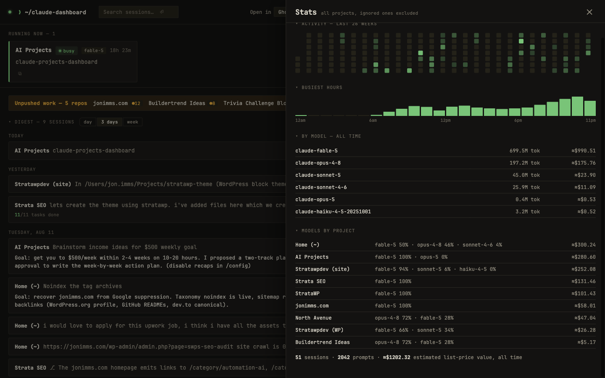

# Claude Dashboard

A local, zero-dependency dashboard for all your [Claude Code](https://claude.com/claude-code) projects. Live sessions pinned at the top — including whether one is waiting on your input — with a card per project below: recent sessions, git status, a 14-day activity sparkline, and one-click resume commands.

Everything is read from local files under `~/.claude`, and it never writes to Claude's data — read-only. No API keys to configure. The only automatic network call is to Anthropic's own usage API for your quota meters, authenticated with the Keychain credentials Claude Code already holds (kept in memory, toggleable in settings). Plain Node.js (which Claude Code already requires), zero npm dependencies, macOS.

**Requirements:** macOS or Linux (or Windows, experimental — see below), Node.js ≥ 18, Claude Code.


## Try it in one command

```bash
npx claude-mission-control
```

That downloads nothing permanent, starts the server, and opens the dashboard in your browser (add `--no-open` to skip that). Run it again while it's already up and it just opens the tab. Like it? Install it for real below.

Homebrew works too:

```bash
brew tap jonimmswordpressdev/claude-dashboard
brew trust jonimmswordpressdev/claude-dashboard   # newer brew asks once for third-party taps
brew install claude-dashboard
brew services start claude-dashboard   # always-on, starts at login
```

## Install (always-on)

```bash
./install.sh
```

That registers a LaunchAgent (macOS) or a systemd user service (Linux) so the server runs at login and restarts if it dies. Then open <http://127.0.0.1:4517> — in Safari, use **File → Add to Dock** to get a standalone app-like window with its own Dock icon; in Chrome or Edge, use the install-app button in the address bar (the dashboard is a PWA).

Uninstall with `./uninstall.sh`.

On Linux: logs are in `journalctl --user -u claude-dashboard`, notifications use `notify-send`, and sessions open in kitty, Alacritty, GNOME Terminal, Konsole, or xterm — whichever is installed.

## Run manually instead

```bash
node server.js
```

## New to the terminal? Step-by-step install

Five minutes, no experience needed. You type (or paste) each command into the Terminal app and press Return.

1. **Open Terminal.** Press `⌘ Space`, type `terminal`, press Return. A window appears where you can type commands.
2. **Check Node.js.** Type `node --version` and press Return. A number like `v22.1.0` means you're set — anything 18 or higher works. If it says "command not found", install Node from [nodejs.org](https://nodejs.org) (download, run the installer, then close and reopen Terminal and check again). If you already use Claude Code, you almost certainly have it.
3. **Get the code.** Paste this and press Return:

   ```bash
   git clone https://github.com/JonImmsWordpressDev/claude-dashboard.git ~/claude-dashboard
   ```

   That copies the project into a `claude-dashboard` folder in your home folder. No git? Use the green **Code → Download ZIP** button on the GitHub page and unzip it instead.
4. **Move into the folder.** Type `cd ~/claude-dashboard` and press Return.
5. **Install.** Type `./install.sh` and press Return. That's the whole setup — the dashboard now starts itself every time you log in.
6. **Open it.** Go to <http://127.0.0.1:4517> in your browser and bookmark it. In Safari, **File → Add to Dock** turns it into its own app with a Dock icon.
7. **One possible prompt.** The first time, macOS may ask about Keychain access for the usage meters. Click **Always Allow**. That reuses the sign-in Claude Code already has; nothing new to log in to.

You should see a dark board listing your projects. If a Claude Code session is running, it appears as a row at the top — and the status cell turns amber with **needs you** when Claude is waiting for your input.

**Using it day to day** — three things cover most of it:

- **Glance at the top row.** That's what's running right now. Amber **needs you** means go back to that terminal — Claude asked a question.
- **Click any session title** to read the whole conversation. If it's still running, new messages stream in live.
- **Click `open ⬈`** next to an old session to pick it up again — it opens a terminal in the right folder with the conversation restored.

If something looks off, the log is at `~/Library/Logs/claude-dashboard.log`. To remove everything, run `./uninstall.sh` from the same folder.

## What you're looking at

- **Departures** — every live `claude` CLI session as a row on the board: start time, project, current task, model, elapsed time, and a split-flap status cell. The cell flips to an amber **needs you** when a session is waiting on your input — readable from across the room.
- **Digest** — what happened across every project, grouped by day. Each entry shows the session's recap (Claude's own "away summary" where one exists — click to expand), how many tasks it completed, and an open button. Switch the window between day / 3 days / week; collapses out of the way and remembers your choice.
- **Project cards** — sorted by last activity. Branch chip, `●n` uncommitted changes, `↑n` unpushed commits. The sparkline is prompts per day for the last two weeks. Each session row has an `open ⬈` button that resumes the session in your terminal (new window, right directory) or imports it into the Claude desktop app when it's installed — the **Open in** selector in the header names whichever terminal you've configured (auto-detected on first run). The `⧉` button copies the `claude --resume` command instead.
- **Header meters** — your plan and rate-limit tier (Free/Pro/Max/Enterprise/API, detected from Claude Code's local account cache), live session and weekly usage from Anthropic's usage API via your existing Claude Code sign-in, plus extra-usage spend. First run may show one macOS Keychain prompt — click Always Allow.


- **Transcripts** — click any session title (cards, digest, search results, project drawer) to read the conversation: your prompts, Claude's replies rendered as markdown, tool calls as compact one-liners, and away-summaries highlighted. Long sessions show the newest ~1200 events. **Running sessions follow live** — a `● live` badge appears, new turns stream in every few seconds, and the view sticks to the bottom unless you've scrolled up to read.
- **Search** — the header box searches every prompt you've ever sent plus all session titles (Enter to run, 2+ characters). Narrow with `project:name` or `since:7d` / `since:2026-08-01`. Clicking a prompt result opens the transcript scrolled to the matching turn.
- **Command palette** — `⌘K` from anywhere: fuzzy-jump to any project or session, watch a live session, start a new one, open settings or stats. Arrow keys + Enter.
- **Stats** — click the weekly bar chart in the header: a 26-week activity heatmap, your busiest hours, a weekly-rhythm grid (prompts by day of week and hour), estimated spend per day for the last 90 days, and an all-time per-model token/cost breakdown. The daily spend history is computed from your existing transcripts, so it's full from the first run.
- **Export** — any transcript downloads as clean markdown via the `export ⇩` button.
- **New session** — the `⊕` button on a project card opens a fresh terminal window in that project running `claude`.
- **Cost trend** — the small bar chart in the header is estimated cost per week for the last 8 weeks (hover for numbers). Costs include subagent tokens.
- **Models everywhere** — every session shows which model ran it (live cards, digest, session lists), and the stats view breaks down usage per model and per project.
- **Claude.ai chats** — import the official export from claude.ai (Settings → Privacy → Export data, then feed `conversations.json` to ⚙ settings here) and your chats become browsable (`⌘K` → Claude.ai chats) and full-text searchable next to your coding sessions. Stored slimmed in your local config dir, gitignored, never uploaded anywhere.


- **Project details** — click any project's name for a slide-over with its full session list, rendered CLAUDE.md, per-project memory files, skills/agents/commands from `.claude/`, and settings (permissions, MCP servers, allowed tools). Read-only; also a quick audit of which projects are missing instructions or memory. Esc closes.
- **Unpushed work strip** — an amber band listing every repo with uncommitted changes (`●n`) or unpushed commits (`↑n`), sorted by recent activity. Disappears when everything's clean.
- **Dormant** — projects with no activity for 60+ days, tucked away at the bottom.
- Worktree sessions (`.claude/worktrees/…`) are folded into their parent project and badged `⎇`.
- **Notifications** — the moment any session flips to "waiting for input", you get a macOS notification (with sound) naming the project. Fires once per wait, never on server restart. Mute a single noisy project from its slide-over (the bell button at the top), or disable everything with `CLAUDE_DASH_NOTIFY=0` in the plist. Notifications arrive via Script Editor/osascript — if you don't see them, allow it under System Settings → Notifications.
- **Cost estimates** — the header shows the estimated list-price value of the last 7 days across all projects; each project card and digest entry shows its share. Computed from token usage in the transcripts at Anthropic list rates (cache reads at 0.1×, cache writes at 1.25×). On a subscription plan these are relative weights, not billed dollars — use them to see where your usage goes. Subagent tokens are included.
- **Stuck flag** — a session that's "busy" but has written nothing to its transcript for 10+ minutes gets an amber `quiet Nm` cell; at 20 minutes you get one notification. It's a hint, not a verdict — a session waiting on slow background work can look the same.


## Menu bar companion

A SwiftBar plugin lives in `menubar/claude-dash.15s.sh`. The menu bar shows `❯ N` while sessions run, `❯ N⚠` in amber when one is waiting on you, and `❯ N?` when a busy session has gone quiet. The dropdown lists live sessions, repos with unpushed work, the 7-day estimate, and an "Open dashboard" link.

Setup: `brew install --cask swiftbar`, then point SwiftBar's plugin folder at this repo's `menubar/` directory. The plugin refreshes every 15 seconds (rename the file to change the interval).

## Settings

The ⚙ gear in the header opens settings — no JSON editing required:

- **Notifications** on/off (writes `config.json`); per-project mute lives on each project's slide-over
- **Terminal** for open/new-session buttons: Ghostty, iTerm2, or Terminal.app, auto-detected (`config.json`)
- **Rename any project** (writes `names.json`) or **hide it** and its whole subtree (writes `ignore.json`), with an unhide list below
- **Theme**: Departures board (follows system light/dark), Phosphor, Amber CRT, Midnight, or Newsprint (`config.json`)
- **Updates**: "check for updates" asks GitHub only when you click; when a new release is out, **update now** pulls it in place (git or npm installs) and service installs restart themselves on the new version

Everything saves instantly; the underlying files stay hand-editable. Keyboard: `⌘K` for the palette, `/` for search, `Esc` closes anything.

## Getting started with config

`names.json`, `ignore.json`, and `config.json` are your local files (gitignored). Copy the `.example` versions to start, or just use the ⚙ settings panel — it creates them for you.

## Friendly names

Edit `names.json` to control how projects are titled:

```json
{ "/Users/you/Local Sites/north-ave": "North Avenue" }
```

Unlisted projects fall back to a cleaned-up folder name. Changes are picked up automatically — no restart needed.

## Hiding projects

Edit `ignore.json` — an array of absolute path prefixes. A project is hidden if its path is, or sits under, any listed prefix, so one line hides a whole tree (e.g. all the plugins/themes inside one site). This only hides them from the dashboard, strip, and menu bar; nothing on disk or in `~/.claude` is touched. Picked up automatically.

## Configuration

| Env var | Default | Meaning |
|---|---|---|
| `CLAUDE_DASH_PORT` | `4517` | Port (change it in the plist too) |
| `CLAUDE_DASH_DEV` | unset | `1` = re-read index.html on every request |
| `CLAUDE_DASH_NOTIFY` | unset | `0` = disable macOS notifications |
| `CLAUDE_DASH_HOST` | `127.0.0.1` | Bind address — see below before changing |
| `CLAUDE_DASH_DEMO` | unset | `1` = serve believable fake data (screenshots, trying it without Claude history) |
| `CLAUDE_DASH_CONFIG_DIR` | repo dir | Where config.json/names.json/ignore.json live (auto-falls back to `~/.config/claude-dashboard`) |

The server binds to `127.0.0.1` only by default.

## Windows (experimental — testers wanted)

The core is plain cross-platform Node, and Windows support is wired in: paths handle drive letters, notifications use native toasts, and sessions open in Windows Terminal, PowerShell, or cmd (auto-detected). Install from PowerShell in the repo folder:

```powershell
.\install.ps1
```

That registers a logon Scheduled Task ("ClaudeDashboard") running the server hidden. Remove it with `.\uninstall.ps1`. The SwiftBar menu bar companion is macOS-only.

**Honest label: this is untested on real Windows** — it was written carefully on a Mac. If you run it on Windows, please [open an issue](https://github.com/JonImmsWordpressDev/claude-dashboard/issues) with what worked and what didn't; the first Windows tester shapes this.

## Access from your phone

The recommended path is [Tailscale](https://tailscale.com): install it on the Mac and your phone, then run `tailscale serve --bg 4517`. That publishes the dashboard over HTTPS inside your private tailnet while the server itself stays loopback-only — nothing is exposed to the internet or your LAN. Alternatively set `CLAUDE_DASH_HOST=0.0.0.0` in the plist to bind to all interfaces, but understand what that means: anyone on the same network can view the dashboard **and use the open/new-session endpoints, which launch terminal commands on this Mac**. Don't do that on a network you don't fully control.

## Maintenance

- Logs: `~/Library/Logs/claude-dashboard.log`
- Restart after pulling changes: `launchctl kickstart -k gui/$(id -u)/com.claude-dashboard`
- Tests: `node --test test/pure-logic.test.js`

## Data sources

| What | Where |
|---|---|
| Live sessions | `~/.claude/sessions/<pid>.json` (liveness re-checked against the pid) |
| Project registry | `~/.claude.json` `projects` map |
| Session titles | `~/.claude/projects/**/**.jsonl` (`ai-title` records, head/tail scan only — never full parses) |
| Activity | `~/.claude/history.jsonl` |
| Session todos | `~/.claude/tasks/<sessionId>/` |
| Usage meters | Anthropic usage API via Claude Code's Keychain sign-in (fallback: `~/.claude/.statusline-usage-cache`) |

## Credits

Built by [Jon Imms](https://jonimms.com) — WordPress and Gutenberg developer writing about AI-assisted development — pair-programmed with [Claude Code](https://claude.com/claude-code). The story of how it was built is in [the launch post](https://jonimms.com/blog/claude-code-dashboard/). MIT licensed; issues and PRs welcome.
