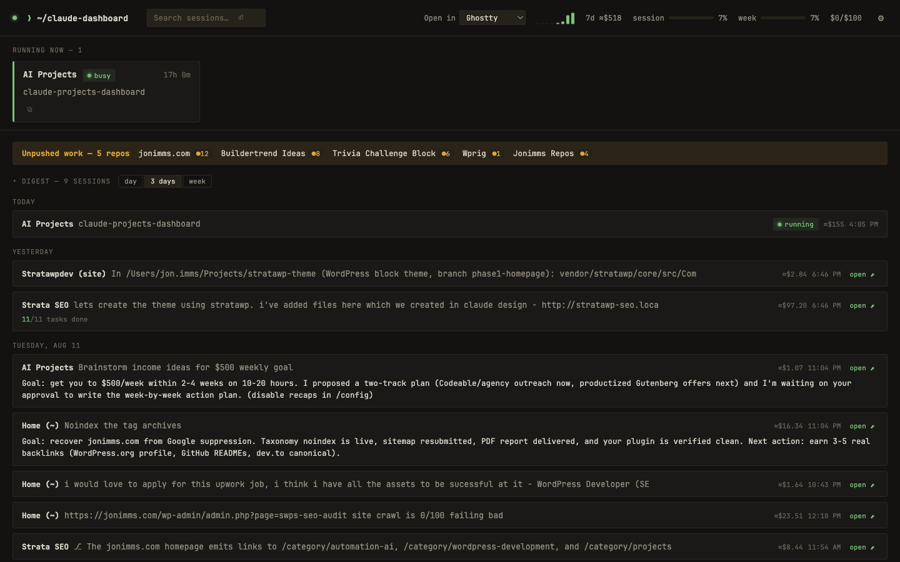
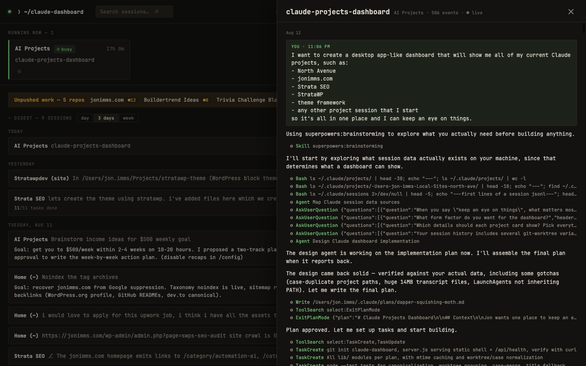
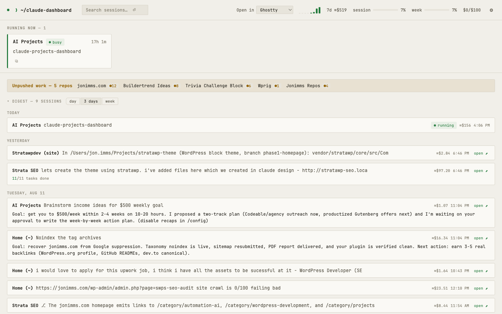

# Claude Dashboard

A local, zero-dependency dashboard for all your [Claude Code](https://claude.com/claude-code) projects. Live sessions pinned at the top — including whether one is waiting on your input — with a card per project below: recent sessions, git status, a 14-day activity sparkline, and one-click resume commands.

Everything is read from local files under `~/.claude`. No API keys, no external services, nothing leaves your machine, and it never writes to Claude's data — read-only. Plain Node.js (which Claude Code already requires), zero npm dependencies, macOS.

**Requirements:** macOS, Node.js ≥ 18, Claude Code.



## Install (always-on)

```bash
./install.sh
```

That registers a LaunchAgent so the server runs at login and restarts if it dies. Then open <http://127.0.0.1:4517> — in Safari, use **File → Add to Dock** to get a standalone app-like window with its own Dock icon.

Uninstall with `./uninstall.sh`.

## Run manually instead

```bash
node server.js
```

## What you're looking at

- **Running now** — every live `claude` CLI session. Amber pulse = waiting on your input. Shows the session's current task and elapsed time.
- **Digest** — what happened across every project, grouped by day. Each entry shows the session's recap (Claude's own "away summary" where one exists — click to expand), how many tasks it completed, and an open button. Switch the window between day / 3 days / week; collapses out of the way and remembers your choice.
- **Project cards** — sorted by last activity. Branch chip, `●n` uncommitted changes, `↑n` unpushed commits. The sparkline is prompts per day for the last two weeks. Each session row has an `open ⬈` button that resumes the session in your terminal (new window, right directory) or imports it into the Claude desktop app — pick your default with the **Open in** selector in the header. The `⧉` button copies the `claude --resume` command instead.
- **Header meters** — session and weekly usage from Claude's own statusline cache, plus extra-usage spend.


- **Transcripts** — click any session title (cards, digest, search results, project drawer) to read the conversation: your prompts, Claude's replies rendered as markdown, tool calls as compact one-liners, and away-summaries highlighted. Long sessions show the newest ~1200 events. **Running sessions follow live** — a `● live` badge appears, new turns stream in every few seconds, and the view sticks to the bottom unless you've scrolled up to read.
- **Search** — the header box searches every prompt you've ever sent plus all session titles (Enter to run, 2+ characters). Results open straight into transcripts.
- **New session** — the `⊕` button on a project card opens a fresh terminal window in that project running `claude`.
- **Cost trend** — the small bar chart in the header is estimated cost per week for the last 8 weeks (hover for numbers). Costs include subagent tokens.
- **Project details** — click any project's name for a slide-over with its full session list, rendered CLAUDE.md, per-project memory files, skills/agents/commands from `.claude/`, and settings (permissions, MCP servers, allowed tools). Read-only; also a quick audit of which projects are missing instructions or memory. Esc closes.
- **Unpushed work strip** — an amber band listing every repo with uncommitted changes (`●n`) or unpushed commits (`↑n`), sorted by recent activity. Disappears when everything's clean.
- **Dormant** — projects with no activity for 60+ days, tucked away at the bottom.
- Worktree sessions (`.claude/worktrees/…`) are folded into their parent project and badged `⎇`.
- **Notifications** — the moment any session flips to "waiting for input", you get a macOS notification (with sound) naming the project. Fires once per wait, never on server restart. Disable with `CLAUDE_DASH_NOTIFY=0` in the plist. Notifications arrive via Script Editor/osascript — if you don't see them, allow it under System Settings → Notifications.
- **Cost estimates** — the header shows the estimated list-price value of the last 7 days across all projects; each project card and digest entry shows its share. Computed from token usage in the transcripts at Anthropic list rates (cache reads at 0.1×, cache writes at 1.25×). On a subscription plan these are relative weights, not billed dollars — use them to see where your usage goes. Subagent tokens are included.
- **Stuck flag** — a session that's "busy" but has written nothing to its transcript for 10+ minutes gets an amber `quiet Nm` chip; at 20 minutes you get one notification. It's a hint, not a verdict — a session waiting on slow background work can look the same.



## Menu bar companion

A SwiftBar plugin lives in `menubar/claude-dash.15s.sh`. The menu bar shows `❯ N` while sessions run, `❯ N⚠` in amber when one is waiting on you, and `❯ N?` when a busy session has gone quiet. The dropdown lists live sessions, repos with unpushed work, the 7-day estimate, and an "Open dashboard" link.

Setup: `brew install --cask swiftbar`, then point SwiftBar's plugin folder at this repo's `menubar/` directory. The plugin refreshes every 15 seconds (rename the file to change the interval).

## Settings

The ⚙ gear in the header opens settings — no JSON editing required:

- **Notifications** on/off (writes `config.json`)
- **Terminal** for open/new-session buttons: Ghostty, iTerm2, or Terminal.app, auto-detected (`config.json`)
- **Rename any project** (writes `names.json`) or **hide it** and its whole subtree (writes `ignore.json`), with an unhide list below

Everything saves instantly; the underlying files stay hand-editable. Press `/` anywhere to jump to search.

## Getting started with config

`names.json`, `ignore.json`, and `config.json` are your local files (gitignored). Copy the `.example` versions to start, or just use the ⚙ settings panel — it creates them for you.

## Friendly names

Edit `names.json` to control how projects are titled:

```json
{ "/Users/you/Local Sites/north-ave": "North Avenue" }
```

Unlisted projects fall back to a cleaned-up folder name. Changes are picked up automatically — no restart needed.

## Hiding projects

Edit `ignore.json` — an array of absolute path prefixes. A project is hidden if its path is, or sits under, any listed prefix, so one line hides a whole tree (e.g. all the plugins/themes inside one site). This only hides them from the dashboard, strip, and menu bar; nothing on disk or in `~/.claude` is touched. Picked up automatically.

## Configuration

| Env var | Default | Meaning |
|---|---|---|
| `CLAUDE_DASH_PORT` | `4517` | Port (change it in the plist too) |
| `CLAUDE_DASH_DEV` | unset | `1` = re-read index.html on every request |
| `CLAUDE_DASH_NOTIFY` | unset | `0` = disable macOS notifications |
| `CLAUDE_DASH_HOST` | `127.0.0.1` | Bind address — see below before changing |

The server binds to `127.0.0.1` only by default.

## Access from your phone

The recommended path is [Tailscale](https://tailscale.com): install it on the Mac and your phone, then run `tailscale serve --bg 4517`. That publishes the dashboard over HTTPS inside your private tailnet while the server itself stays loopback-only — nothing is exposed to the internet or your LAN. Alternatively set `CLAUDE_DASH_HOST=0.0.0.0` in the plist to bind to all interfaces, but understand what that means: anyone on the same network can view the dashboard **and use the open/new-session endpoints, which launch terminal commands on this Mac**. Don't do that on a network you don't fully control.

## Maintenance

- Logs: `~/Library/Logs/claude-dashboard.log`
- Restart after pulling changes: `launchctl kickstart -k gui/$(id -u)/com.claude-dashboard`
- Tests: `node --test test/pure-logic.test.js`

## Data sources

| What | Where |
|---|---|
| Live sessions | `~/.claude/sessions/<pid>.json` (liveness re-checked against the pid) |
| Project registry | `~/.claude.json` `projects` map |
| Session titles | `~/.claude/projects/**/**.jsonl` (`ai-title` records, head/tail scan only — never full parses) |
| Activity | `~/.claude/history.jsonl` |
| Session todos | `~/.claude/tasks/<sessionId>/` |
| Usage meters | `~/.claude/.statusline-usage-cache` |

## Credits

Built by [Jon Imms](https://jonimms.com) — WordPress and Gutenberg developer writing about AI-assisted development — pair-programmed with [Claude Code](https://claude.com/claude-code). MIT licensed; issues and PRs welcome.
